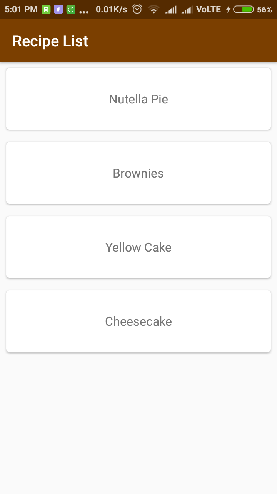
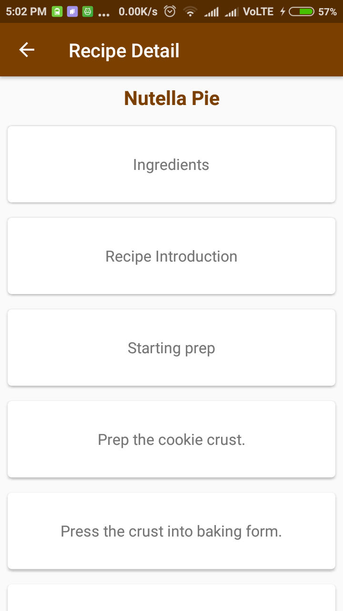
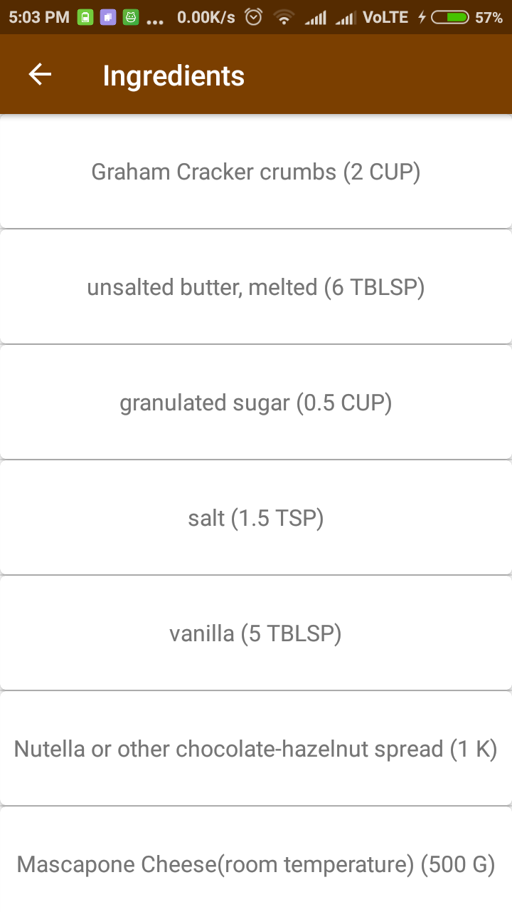
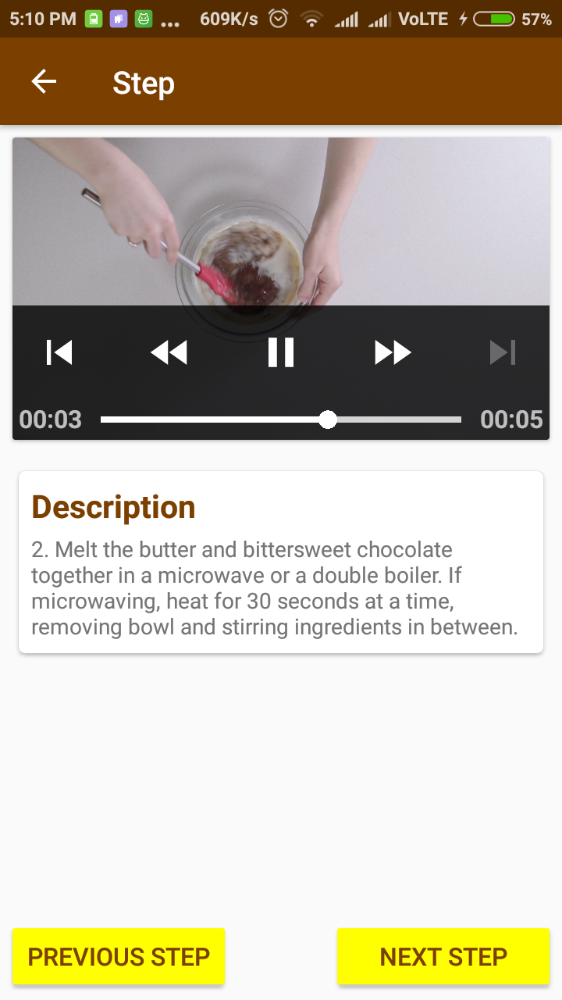
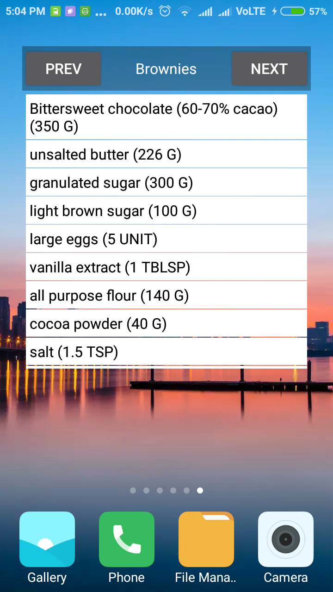

# Baking Recipes

## Project Overview
I productionized an app, taking it from a functional state to a production-ready state. This involved finding and handling error cases, adding accessibility features, allowing for localization, adding a widget, and adding a library.

## Screenshots
<table>
  <tr>
    <td></td>
    <td></td>
    <td></td>
  </tr>
  <tr>
    <td></td>
    <td></td>
  </tr>
</table>

## Used Libraries
* [OkHttp](https://github.com/square/okhttp)
* [Picaso](https://github.com/square/picasso)

## Why this Project?
Working Android developers often have to create and implement apps where they are responsible for designing and planning the steps they need to take to create a production-ready app. Unlike Popular Movies where Udacity gave me an implementation guide, it was left up to me to figure things out for the Baking App.

## What did I Learn?
In this project I learnt to:
* Use MediaPlayer/Exoplayer to display videos.
* Handle error cases in Android.
* Add a widget to your app experience.
* Leverage a third-party library in your app.
* Use Fragments to create a responsive design that works on phones and tablets.

## Rubric
(My project had to meet all rubric specifications in order to get accepted)

### General App Usage
- [x] App should display recipes from provided network resource.
- [x] App should allow navigation between individual recipes and recipe steps.
- [x] App uses RecyclerView and can handle recipe steps that include videos or images.
- [x] App conforms to common standards found in the Android Nanodegree General Project Guidelines.

### Components and Libraries
- [x] Application uses Master Detail Flow to display recipe steps and navigation between them.
- [x] Application uses Exoplayer to display videos.
- [x] Application properly initializes and releases video assets when appropriate.
- [x] Application should properly retrieve media assets from the provided network links. It should properly handle network requests.
- [x] Application makes use of Espresso to test aspects of the UI.
- [x] Application sensibly utilizes a third-party library to enhance the app's features. That could be helper library to interface with Content Providers if you choose to store the recipes, a UI binding library to avoid writing findViewById a bunch of times, or something similar.

### Homescreen Widget
- [x] Application has a companion homescreen widget.
- [x] Widget displays ingredient list for desired recipe.
